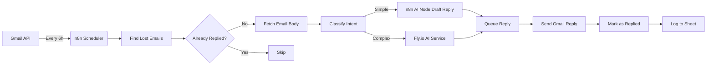

# PLAN: Auto-Reply System for info@pexabo.com

## Executive Summary

Build a robust, AI-powered auto-reply system for **info@pexabo.com** that runs every 6 hours, finds lost/unreplied emails, drafts intelligent responses using your tactics, and marks emails as replied. When you discover a missed email manually, you paste the Gmail link → the system replies to that ONE email and generates a **Fix Prompt** explaining why the batch flow missed it. Complex tasks are offloaded to **Fly.io** microservices. Secrets are managed via **Doppler**.

---

## Architecture Overview



### Components

| Component | Technology | Purpose |
|-----------|-----------|---------|
| Batch Trigger | n8n Schedule (0 */6 * * *) | Runs every 6 hours |
| Individual Trigger | n8n Webhook + Node.js Script | Process one email on demand |
| Email Fetch | Gmail Node (n8n) | Query lost emails |
| Thread Analysis | Gmail API | Check if already replied in thread |
| Intent Analysis | OpenAI GPT-4o (n8n or Fly.io) | Classify email type |
| Recruiter Response | `rifat-cvs-response-generator.fly.dev` | Generate CV-matched recruiter replies |
| CV Selection | Keyword Map + AI | Pick best CV for the role |
| Reply Drafting | OpenAI GPT-4o / Gemini / Groq / Claude | Generate reply text |
| Multi-Model Fallback | Retry chain across providers | If one model fails, try next |
| Complex Tasks | Fly.io Node.js Service | Multi-step reasoning, external APIs |
| Missed Email Fix | AI Analysis + Markdown | Why missed + how to prevent |
| Secrets | Doppler | API keys, tokens |
| State Tracking | Google Sheets | Track replied emails, prevent duplicates |
| Marking | Gmail API | Label + Archive after reply |

---

## Prerequisites (BLOCKING — You Must Complete First)

Before any code is written or deployed, you must complete **all** prerequisites.

**📄 Full checklist**: See `prerequisites.md`
**📋 Task tracker**: See `tasks.md`

### Quick Prerequisites Summary

| Item | What You Need | Where to Get It |
|------|---------------|-----------------|
| Doppler Project | `pexabo-email-automation` | dashboard.doppler.com |
| Gmail OAuth | Client ID, Client Secret, Refresh Token | Google Cloud Console + OAuth Playground |
| OpenAI API Key | `sk-proj-...` | platform.openai.com |
| Gemini API Key | `AIzaSy...` | aistudio.google.com |
| n8n API Key | `n8n_api_...` | n8n.rifaterdemsahin.com → Settings → API |
| Google Sheets | Tracker spreadsheet + service account | Google Cloud Console + Sheets |
| Telegram (opt) | Bot token + chat ID | @BotFather + API |

**⏱️ Time estimate**: ~70 minutes total

---

## Phase 1: Foundation (Week 1)

### 1.1 Doppler Setup
- Create Doppler project: `pexabo-email-automation`
- Secrets to store (full list in `prerequisites.md`):
  - `GMAIL_REFRESH_TOKEN` (OAuth2 for info@pexabo.com)
  - `GMAIL_CLIENT_ID`, `GMAIL_CLIENT_SECRET`
  - `OPENAI_API_KEY` (Primary model)
  - `GEMINI_API_KEY` (Google AI — primary for recruiter CV responses)
  - `GROQ_API_KEY` (Fast inference fallback)
  - `ANTHROPIC_API_KEY` (Claude fallback)
  - `N8N_API_KEY`
  - `N8N_WEBHOOK_URL`
  - `FLY_IO_API_TOKEN`
  - `RECRUITER_GENERATOR_URL` = `https://rifat-cvs-response-generator.fly.dev/recruiter`
  - `GOOGLE_SHEETS_CREDENTIALS`

### 1.2 Gmail API Access
- Enable Gmail API in Google Cloud Console
- OAuth2 consent screen for `info@pexabo.com`
- Scopes: `https://www.googleapis.com/auth/gmail.modify`
- Store refresh token in Doppler

### 1.3 Google Sheets Tracking
- Create sheet: `Pexabo Email Tracker`
- Columns:
  - `email_id` | `thread_id` | `from` | `subject` | `received_at` | `classified_as` | `tactic_used` | `reply_sent_at` | `status` | `ai_confidence`

---

## Phase 2: n8n Workflow (Week 1-2)

### 2.1 Workflow Nodes

#### Node 1: Schedule Trigger
- **Type**: Cron
- **Expression**: `0 */6 * * *` (every 6 hours)
- **Timezone**: Europe/London

#### Node 2: Fetch Emails (Gmail)
- **Query**: `to:info@pexabo.com -from:me -in:sent -label:replied_by_bot newer_than:7d`
- **Max Results**: 50
- **Include Spam/Trash**: No

#### Node 3: Check Thread History (Reply Detection)
- For each email, fetch all messages in the thread
- Check if `info@pexabo.com` (or `from:me`) already sent a reply in this thread
- **If already replied → SKIP** (label: `already_replied_in_thread`)
- This prevents double-replies even if the `replied_by_bot` label is missing

#### Node 4: Deduplicate (Sheets)
- Lookup `email_id` in tracker
- If exists and `status=replied`, filter out

#### Node 5: Classify Intent (OpenAI)
- **System Prompt**: Use `tactics-template.md` categories
- **Input**: Subject + Snippet + Body (first 2000 chars)
- **Output JSON**:
  ```json
  {
    "intent": "pricing_inquiry|partnership|support|spam|other",
    "urgency": "high|medium|low",
    "needs_human": true|false,
    "suggested_tactic": "tactic_id",
    "confidence": 0.95
  }
  ```

#### Node 5: Route Decision
- If `needs_human=true` → Add label `needs_human_review`, skip reply
- If `confidence < 0.8` → Send to Fly.io for deeper analysis
- If `intent == "recruiter_job_offer"` → Route to Recruiter Response Pipeline
- Else → Draft reply in n8n

#### Node 6: Recruiter Response Pipeline (Job Offers Only)
**Only triggered when email is classified as a recruiter/job offer.**

1. **CV Selection**: Map job keywords to CV file
   - "Azure" → `cv_azure_architect.pdf`
   - "AWS" → `cv_aws_architect.pdf`
   - "Kubernetes" → `cv_kubernetes_engineer.pdf`
   - Default → `cv_ai_engineer.pdf`

2. **Call Recruiter Generator**: POST to `https://rifat-cvs-response-generator.fly.dev/recruiter`
   - Payload: `{ recruiter_message, cv_source_url, ai_provider }`
   - Returns: `{ generated_response, confidence, evidence }`

3. **Multi-Model Fallback**:
   - Try **Gemini** first (best for CV evidence extraction)
   - If Gemini fails/times out → Try **GPT-4o**
   - If GPT-4o fails → Try **Groq (Llama-3)**
   - If Groq fails → Try **Claude 3.5 Sonnet**
   - If all fail → Route to human review

4. **Format Reply**: Inject generated response into email template with CV link

#### Node 7: Draft Reply (OpenAI / Tactics / Multi-Model)
- Load tactic from `tactics-template.md`
- **Multi-Model Strategy**:
  1. Try primary model (Gemini for recruiter emails, GPT-4o for others)
  2. On timeout (5s) or error → Retry once with same model
  3. On second failure → Switch to fallback model
  4. Log which model succeeded to tracker
- Include signature from `config/signature.html`

#### Node 8: Send Reply (Gmail)
- **To**: Original sender
- **Subject**: `Re: {{ $json.subject }}`
- **Body**: Drafted reply (HTML)
- **Thread ID**: Keep in same thread

#### Node 9: Mark as Replied
- **Label**: `replied_by_bot`
- **Archive**: Yes (remove from inbox)
- **Mark Read**: Optional (configurable)

#### Node 10: Log to Sheets
- Append row with all metadata
- **New columns**: `model_used`, `recruiter_response_used`, `cv_sent`

---

## Phase 3: Fly.io Complex Task Service (Week 2)

### 3.1 When to Use Fly.io
- Multi-step reasoning (e.g., "I want a quote for X, Y, Z")
- External API lookups (e.g., check calendar, pricing DB)
- Custom formatting (e.g., generate PDF proposal)
- Fallback when OpenAI confidence is low

### 3.2 Service Design
- **App**: `pexabo-email-brain`
- **Framework**: Fastify (Node.js)
- **Endpoint**: `POST /process`
- **Payload**:
  ```json
  {
    "email": { "from": "...", "subject": "...", "body": "...", "thread_id": "..." },
    "tactics": ["tactic_id"],
    "context": { "previous_emails": [] }
  }
  ```
- **Response**:
  ```json
  {
    "reply": "...",
    "actions": [{"type": "calendar_invite", "data": {}}],
    "confidence": 0.92,
    "should_reply": true
  }
  ```

### 3.3 Deployment
- Dockerfile + fly.toml
- Doppler integration for secrets
- Scale to zero (wake on request) to save cost

---

## Phase 4: Tactics System (Ongoing)

### 4.1 How It Works
1. You provide email links and describe desired reply style
2. We extract patterns → save as Tactic in `tactics-template.md`
3. Tactic is injected into OpenAI system prompt
4. AI uses tactic to draft reply

### 4.2 Tactic Format
See `tactics-template.md`

---

## Phase 5: Recurring Operation (Ongoing)

### Every 6 Hours (Automated — Batch Mode)
1. n8n triggers
2. Scans `info@pexabo.com` for unreplied emails
3. Classifies, drafts, sends, marks, logs

### On Demand (Manual — Individual Mode)
1. You paste a Gmail URL of a missed email
2. System extracts message ID, fetches email
3. Classifies, drafts reply, asks for approval
4. Sends reply, marks as replied, logs
5. **Generates Fix Prompt** → saves to `investigations/`
6. Fix prompt explains why batch flow missed it + how to prevent

### Weekly (Manual Review)
1. Check `needs_human_review` label in Gmail
2. Review Google Sheets for errors/low confidence
3. Review `investigations/` folder for fix prompts to apply
4. Update tactics based on new patterns

### Feedback Loop
1. When you provide feedback on a reply
2. We update the tactic or add a new one
3. Re-process similar future emails with improved logic

---

## Phase 6: Monitoring & Alerts

### Telegram Alerts (n8n)
- Low confidence replies (>3 in a batch)
- Failed sends
- Fly.io timeouts

### Dashboard (Google Sheets or Fly.io)
- Emails processed today/week
- Average confidence
- Human review queue size

---

## Success Criteria

- [ ] Zero lost emails older than 6 hours
- [ ] 90%+ auto-replied without human intervention
- [ ] All replied emails labeled `replied_by_bot`
- [ ] Tactics updated within 24h of feedback
- [ ] Every missed email gets a Fix Prompt within 1 hour of discovery
- [ ] Fix Prompts applied to workflow within 48 hours
- [ ] Fly.io handles complex tasks < 5s response time

---

## Next Steps (Action Items)

1. **You**: Complete all prerequisites in `prerequisites.md`
2. **You**: Confirm all secrets are stored in Doppler `prd` environment
3. **You**: Create Google Sheet "Pexabo Email Tracker" and share with service account
4. **Me**: Begin MCP-based n8n workflow generation (Phase 2 in `tasks.md`)
5. **Me**: Deploy Fly.io `pexabo-email-brain` service
6. **Me**: Push n8n workflow via API and activate
7. **Us**: Test end-to-end with dry-run on real emails
8. **Us**: Go live with batch mode every 6 hours

---

## File Inventory

| File | Purpose |
|------|---------|
| `PLAN.md` | This document — master architecture |
| `README.md` | Quick start + MCP workflow explanation |
| `prerequisites.md` | ⭐ Everything you need to provide before we start |
| `tasks.md` | ⭐ Task tracker with owners, status, and progress |
| `workflow-design.md` | n8n node-by-node spec (MCP reads this) |
| `doppler-config.md` | Secret management guide |
| `fly-io-services.md` | Fly.io app design + multi-model fallback |
| `tactics-template.md` | Your reply tactics |
| `missed-email-fix-template.md` | Template for analyzing why emails were missed |
| `execution-checklist.md` | Operational runbook |
| `scripts/gmail-query-builder.js` | Helper to test Gmail queries |
| `scripts/n8n-workflow-updater.js` | Push workflow JSON to n8n (MCP deployment) |
| `scripts/mark-replied.js` | Bulk mark emails script |
| `scripts/process-specific-email.js` | Process ONE missed email + generate Fix Prompt |
| `investigations/` | Auto-generated Fix Prompts for each missed email |
| `backups/` | n8n workflow snapshots |

---

*Created: 2026-05-09*
*Status: Draft — awaiting your input on tactics and OAuth setup*
