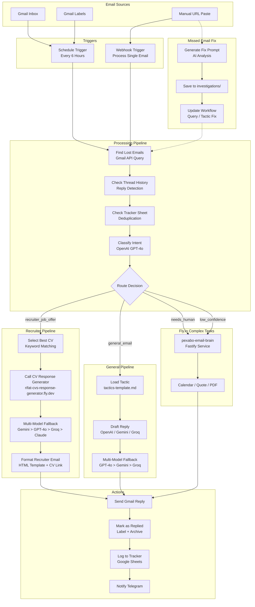
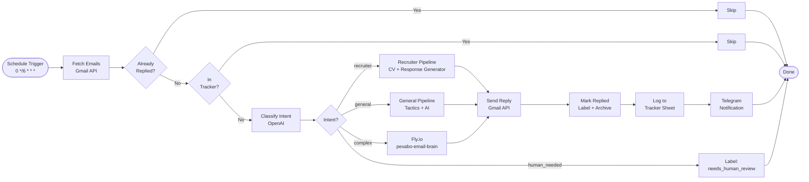
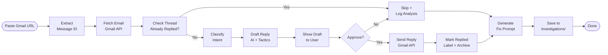
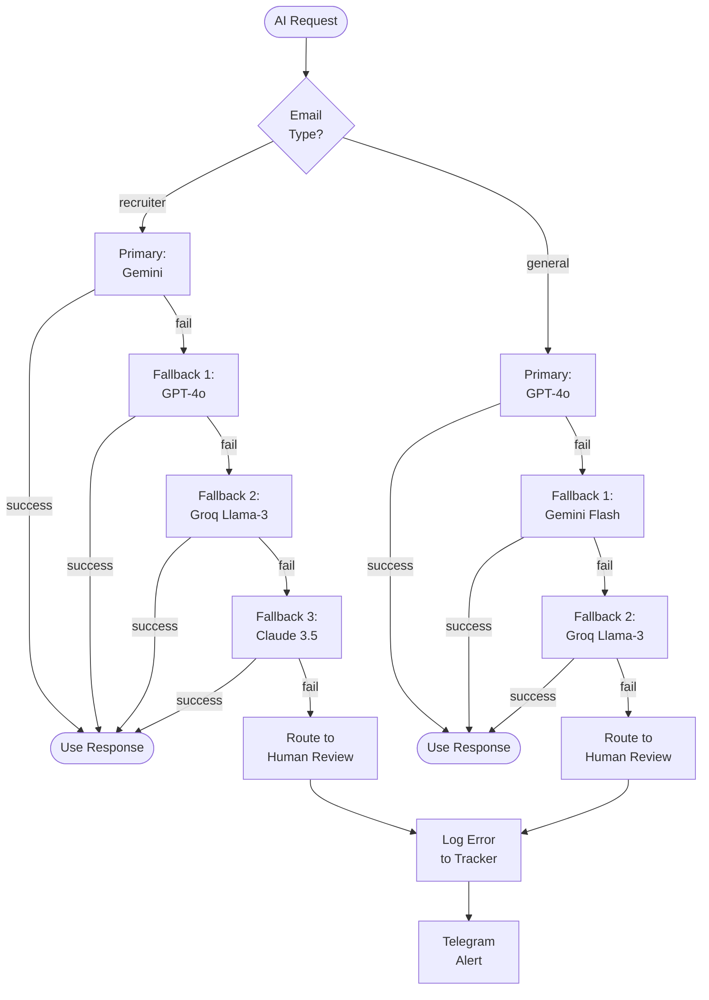
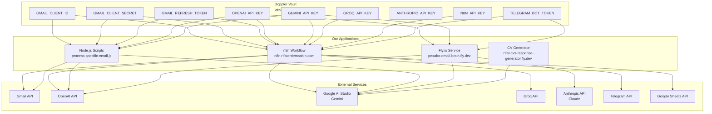

# System Architecture Diagram

> This diagram shows the complete flow of the Auto-Reply System for info@pexabo.com.
> Render this file with any Mermaid-compatible viewer (GitHub, VS Code, Mermaid Live Editor).

---

## Diagram 1: High-Level Architecture

---

## Diagram 2: Batch Mode Flow (Every 6 Hours)

---

## Diagram 3: Individual Mode Flow (Manual URL)

---

## Diagram 4: Multi-Model Fallback Chain

---

## Diagram 5: Data Flow / Secrets

---

## Diagram 6: Folder Structure

```mermaid
flowchart TD
    ROOT["Auto-Reply info@pexabo.com/"] --> PLAN["PLAN.md"]
    ROOT --> README["README.md"]
    ROOT --> PREREQ["prerequisites.md"]
    ROOT --> TASKS["tasks.md"]
    ROOT --> WORKFLOW["workflow-design.md"]
    ROOT --> DOPPLER["doppler-config.md"]
    ROOT --> FLYIO["fly-io-services.md"]
    ROOT --> TACTICS["tactics-template.md"]
    ROOT --> FIXTEMP["missed-email-fix-template.md"]
    ROOT --> CHECKLIST["execution-checklist.md"]
    ROOT --> MERMAID["architecture-diagram.md<br/>This file"]
    ROOT --> IMPL["implementation-steps.md"]

    ROOT --> SCRIPTS["scripts/"]
    SCRIPTS --> S1["gmail-query-builder.js"]
    SCRIPTS --> S2["n8n-workflow-updater.js"]
    SCRIPTS --> S3["mark-replied.js"]
    SCRIPTS --> S4["process-specific-email.js"]

    ROOT --> INVEST["investigations/"]
    INVEST --> I1["missed_email_YYYY-MM-DD_*.md"]

    ROOT --> BACKUPS["backups/"]
    BACKUPS --> B1["workflow-YYYY-MM-DD.json"]
```

---

## Rendering Notes (Fail-Safe)

These diagrams use **Mermaid syntax** that is compatible with:

- **GitHub** (renders automatically in `.md` files)
- **VS Code** (with Mermaid extension)
- **Mermaid Live Editor** (https://mermaid.live)
- **Notion** (paste as code block)
- **Obsidian** (with Mermaid plugin)

### Fail-Safe Formatting Rules Applied:

1. **No Unicode in node IDs** — Only ASCII letters, numbers, underscores
2. **No special characters in labels** — Uses ` ` for line breaks, not `\n`
3. **Simple arrow types** — Only `-->` and `-.->` (no complex arrowheads)
4. **Subgraphs with quoted names** — `"Name with spaces"` for safety
5. **No `graph` keyword conflicts** — Uses `flowchart` instead of `graph`
6. **Comments in code blocks** — Separated from Mermaid syntax
7. **No emojis in node text** — Plain text only inside diagrams

If a renderer fails, paste the code into https://mermaid.live for guaranteed rendering.

---

*Last updated: 2026-05-09*
