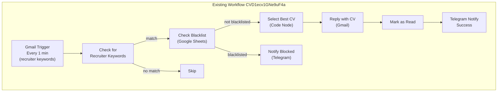
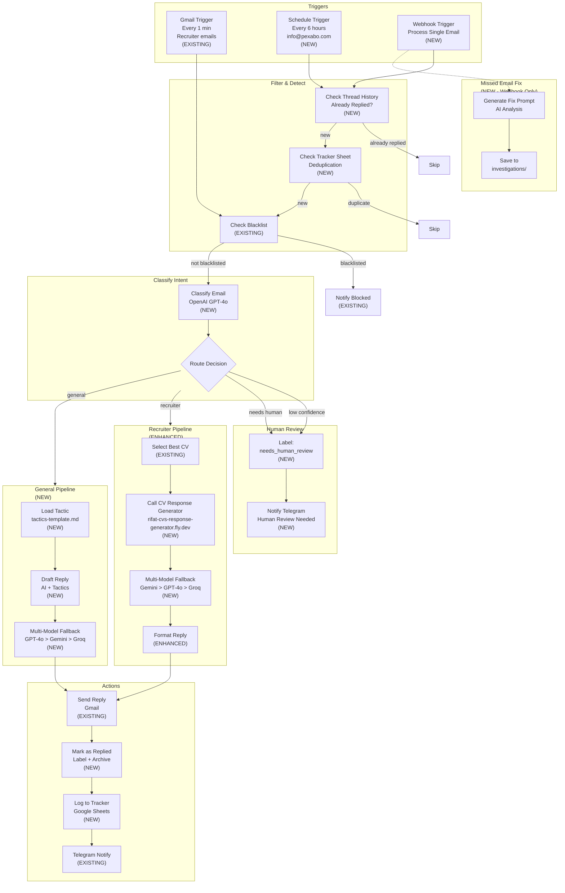

# Updated Architecture: Extend Existing n8n Workflow

> **Key Decision**: We are NOT creating a new workflow. We are **extending** the existing "Respond to Job Offers in Gmail" workflow (ID: `CVD1ecv1GNe9uF4a`) at n8n.rifaterdemsahin.com.
>
> **Why**: The existing workflow already has:
> - ✅ Gmail OAuth2 connector (`YJWBLL2NMyRjSIOr`)
> - ✅ Telegram bot connector (`FNhCBbEpIegop14Z`)
> - ✅ Google Sheets connector (`nR5sxsdC53TDpXoB`)
> - ✅ CV selection logic
> - ✅ Reply template
> - ✅ Blacklist checking
>
> We add **new capabilities** on top.

---

## Existing Workflow Overview (Current State)

**What it does now**:
1. Polls Gmail every minute for unread emails with keywords
2. Checks if sender is blacklisted
3. Selects best CV based on job keywords
4. Replies with CV link
5. Marks as read
6. Notifies Telegram

**What it's missing**:
- ❌ Only handles recruiter emails (not general inquiries to info@pexabo.com)
- ❌ No reply detection (could double-reply)
- ❌ No Fix Prompt generation for missed emails
- ❌ No individual/manual mode for pasting URLs
- ❌ No multi-model fallback
- ❌ No integration with `rifat-cvs-response-generator.fly.dev`
- ❌ No `replied_by_bot` label
- ❌ No tracker sheet logging

---

## Updated Architecture: Extended Workflow

---

## What Changes in n8n

### Nodes to ADD (New)

| # | Node Name | Type | Purpose |
|---|-----------|------|---------|
| 1 | `Schedule Trigger` | `scheduleTrigger` | Every 6 hours for info@pexabo.com |
| 2 | `Webhook Trigger` | `webhook` | POST /process-single-email for manual URLs |
| 3 | `Check Thread Replies` | `gmail` + `code` | Fetch thread, check if already replied |
| 4 | `Check Tracker` | `googleSheets` | Deduplicate via sheet lookup |
| 5 | `Classify Email` | `openAi` or `httpRequest` | GPT-4o intent classification |
| 6 | `Route Decision` | `if` | Route by intent + confidence |
| 7 | `Call CV Generator` | `httpRequest` | POST to rifat-cvs-response-generator.fly.dev |
| 8 | `Multi-Model Fallback` | `code` + `httpRequest` | Retry chain across AI providers |
| 9 | `Load Tactic` | `code` | Load tactics-template.md content |
| 10 | `Draft General Reply` | `openAi` or `httpRequest` | Generate reply from tactic |
| 11 | `Format Recruiter Email` | `code` | Enhanced HTML with CV + Calendly |
| 12 | `Mark Replied` | `gmail` | Add `replied_by_bot` label + archive |
| 13 | `Log to Tracker` | `googleSheets` | Append row with metadata |
| 14 | `Notify Human Review` | `telegram` | Alert when human needed |
| 15 | `Generate Fix Prompt` | `openAi` | Webhook-only: why missed + how to fix |

### Nodes to MODIFY (Existing)

| Node | Current | Change |
|------|---------|--------|
| `Gmail Trigger` | Polls every 1 min for recruiter keywords | Keep as-is for recruiter emails |
| `Select Best CV` | Keyword matching | Keep logic, enhance with more keywords |
| `Reply with CV` | Static HTML template | Replace with dynamic template from CV Generator |
| `Telegram Notify` | Success notification | Enhance with model_used, confidence, CV sent |
| `Mark as Read` | Remove UNREAD label | Add `replied_by_bot` label + archive |

### Nodes to KEEP UNCHANGED

| Node | Reason |
|------|--------|
| `Check Blacklist` | Already works |
| `Notify Blocked` | Already works |
| `Manual Trigger` | For testing |
| `Set Mock Data` | For testing |

---

## Credentials (Already Configured)

We **reuse** these existing credentials — no need to recreate:

| Credential | ID | Used For |
|------------|-----|----------|
| Gmail OAuth2 | `YJWBLL2NMyRjSIOr` | Read/send emails |
| Telegram API | `FNhCBbEpIegop14Z` | Notifications |
| Google Sheets OAuth2 | `nR5sxsdC53TDpXoB` | Blacklist + Tracker |

**New credentials needed**:
- OpenAI API Key (for classification + general replies)
- Gemini API Key (for recruiter responses + fallback)

---

## Workflow IDs

| Workflow | ID | Status |
|----------|-----|--------|
| Existing: Respond to Job Offers | `CVD1ecv1GNe9uF4a` | ✅ Active |
| New: Auto-Reply info@pexabo.com | *(to be created)* | ⬜ Not yet created |

**Option A**: Create a **separate** new workflow for info@pexabo.com (recommended — keeps recruiter workflow untouched)
**Option B**: **Merge** into existing workflow (riskier — could break recruiter flow)

**Recommendation**: Create a new workflow `Auto-Reply info@pexabo.com` that reuses the same credentials.

---

## Migration Plan

### Phase 1: Create New Workflow (30 min)
1. Duplicate existing workflow as template
2. Remove recruiter-specific nodes (keep credentials)
3. Add new nodes for info@pexabo.com flow
4. Test with manual trigger

### Phase 2: Add Enhanced Recruiter Pipeline (30 min)
1. In existing workflow `CVD1ecv1GNe9uF4a`:
2. Replace `Reply with CV` node with enhanced version
3. Add integration with `rifat-cvs-response-generator.fly.dev`
4. Add multi-model fallback

### Phase 3: Connect Workflows (15 min)
1. Ensure both workflows use same credentials
2. Share tracker sheet
3. Unified Telegram notifications

---

*Last updated: 2026-05-09*
*Status: Ready to build on existing n8n instance*
