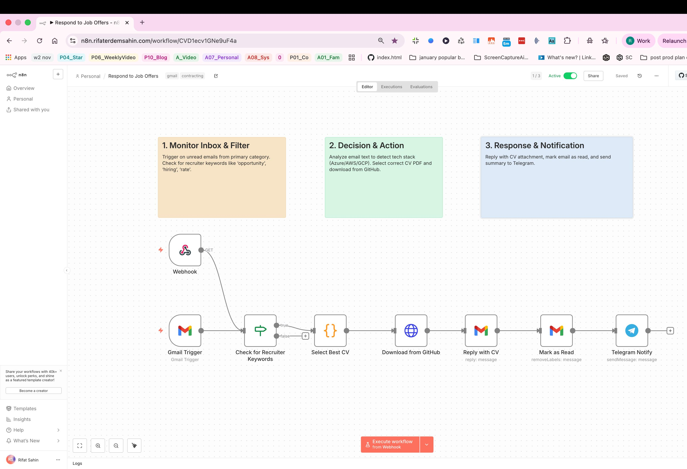
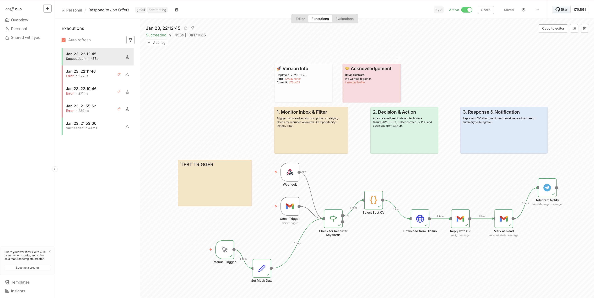
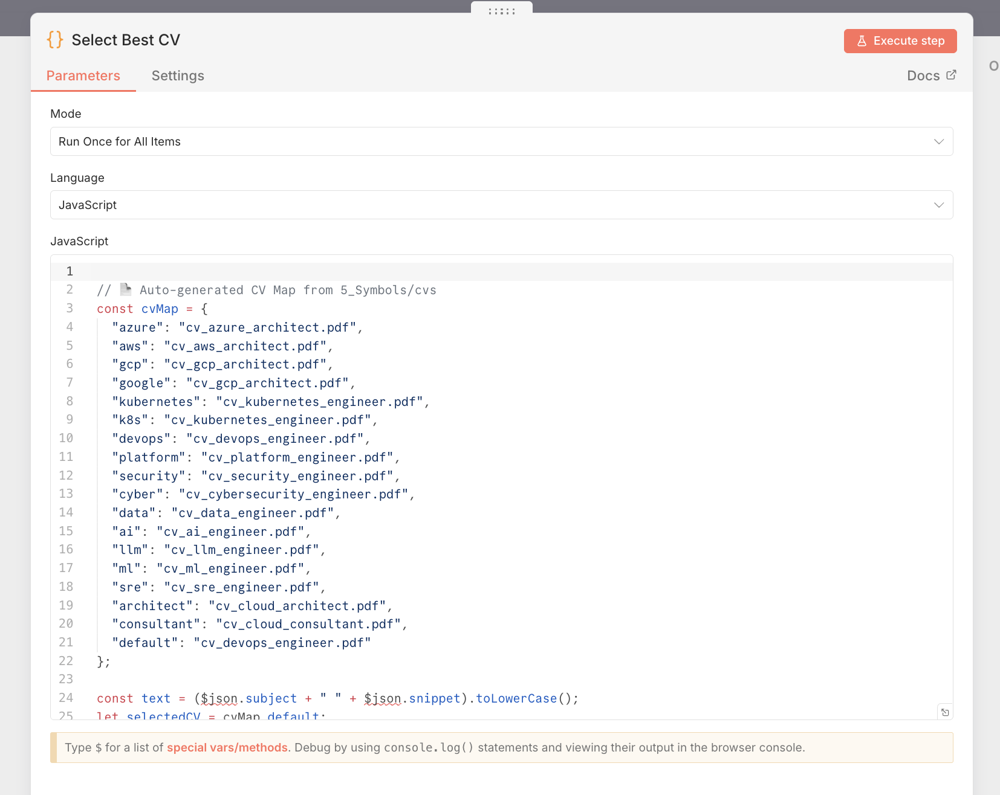
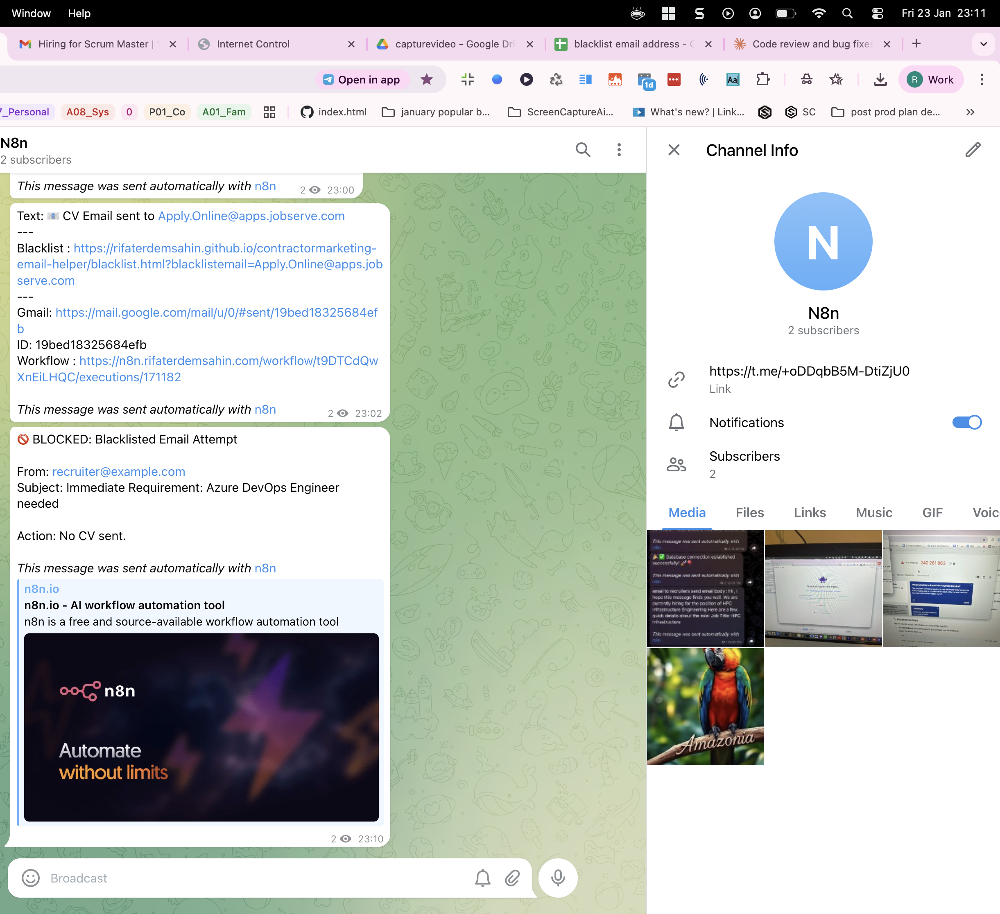
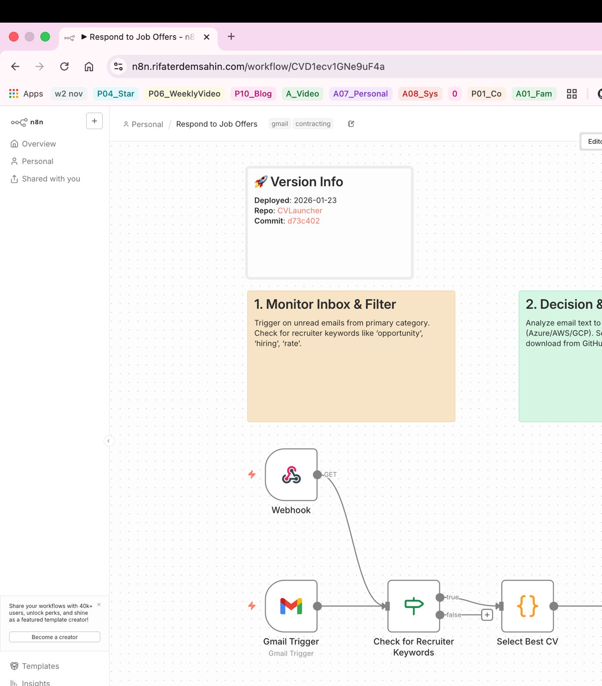

# Visual Guide: Respond to Job Offers Workflow

This document provides a visual walkthrough of the **Respond to Job Offers** workflow, explaining each stage of the process using snapshots of the active execution.

## 1. Full Workflow Overview

The workflow consists of a linear processing pipeline:

1. **Trigger**: Checks for unread emails in Gmail.
2. **Filter/Decision**: Analyzes email content for recruiter keywords.
3. **Security**: Checks the sender against a Blacklist (Google Sheets).
4. **Logic**: Selects the best CV based on the job description.
5. **Action**: Replies with the CV and marks the email as read.
6. **Notification**: Sends a summary to Telegram.

---

## 2. Triggering & Execution

- **Gmail Trigger**: Polls the inbox (every minute) for unread emails containing keywords like `CV`, `Job`, `Opportunity`.
- **Manual Trigger**: Allows for testing with mock data without sending real emails.
- **Execution Tracking**: The workflow execution history logs every run, allowing us to debug specific steps (as seen in the "wait_for_it" execution state).

---

## 3. Intelligent CV Selection Process

This is the core logic engine (Code Node):

- **Input**: Receives the email subject and body snippet.
- **Matching**: It scans for keywords (e.g., `Azure`, `AWS`, `Kubernetes`).
- **Selection**:
  - If "Azure" is found -> Selects `cv_azure_architect.pdf`.
  - If "Kubernetes" is found -> Selects `cv_kubernetes_engineer.pdf`.
  - Fallback -> Defaults to `cv_ai_engineer.pdf` if no specific match is found.
- **Output**: Generates a GitHub raw download URL for the selected PDF.

---

## 4. Notifications (Telegram)

Real-time alerts allow for monitoring the bot's activity without checking logs:

- **Success**: When a CV is sent, the bot reports the **From Address**, **Detected Tech Stack**, and **Sent Filename**.
- **Blocked**: If a user is on the blacklist, a "Blocked" alert is sent instead.

---

## 5. Versioning & Maintenance

Sticky notes on the canvas serve as documentation for maintainers:

- **Version Tag**: Shows the deployment date and Git commit hash.
- **Instructions**: Reminders to "Test Workflow" after updates.
- **Credentials Warning**: Alerts if Google Sheets or API credentials need to be refreshed.
